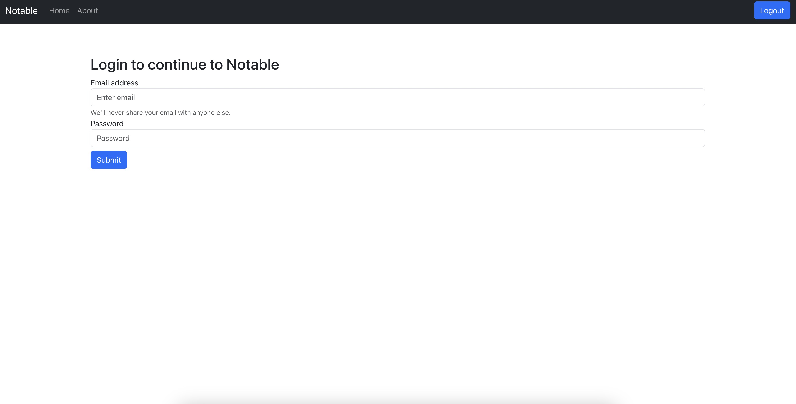

# Note-Taking Web App



## Overview

This is a web-based note-taking application that allows users to create, update, and delete notes. It also includes user authentication for sign-up and login. Users can create their accounts and securely manage their notes.

## Features

- **User Authentication**: Users can sign up for an account, log in, and log out securely.

- **Create Notes**: Users can create new notes with titles and content.

- **Update Notes**: Users can edit and update existing notes.

- **Delete Notes**: Users can delete notes they no longer need.

- **User-Friendly Interface**: The app provides an intuitive and user-friendly interface for managing notes.

- **Responsive Design**: The app is responsive and works well on various screen sizes, including mobile devices.

## Technologies Used

- **Frontend**: HTML, CSS, JavaScript, React.js

- **Backend**: Node.js, Express.js

- **Database**: MongoDB

- **Authentication**: JWT (JSON Web Tokens)

## Getting Started

Follow these steps to get the app up and running on your local machine.

### Prerequisites

- Node.js and npm installed
- MongoDB installed and running
- Git (optional)

### Installation

1. Clone the repository (if you have Git installed):

   ```bash
   git clone https://github.com/your-username/your-note-app.git

# Your Note-Taking Web App


## Overview

This web-based note-taking application allows users to create, update, and delete notes. It includes user authentication for sign-up and login, enabling users to securely manage their notes.

## Getting Started

To run this project locally, follow these steps:

1. **Clone the Repository**:

    Alternatively, you can download the ZIP file of the repository from GitHub.

2. **Navigate to the Project Directory**:

    ```bash
    cd your-note-app
    ```

3. **Install Dependencies**:

    ```bash
    npm install
    ```

4. **Configuration**:

    Create a `.env` file in the root directory and set the following environment variables:

    ```makefile
    PORT=3000
    MONGODB_URI=your_mongodb_uri
    SECRET_KEY=your_secret_key
    ```

    Replace `your_mongodb_uri` with your MongoDB connection URI and `your_secret_key` with a secret key for JWT token generation.

5. **Running the App**:

    Start the server:

    ```bash
    npm start
    ```

    The server will start on port 3000 by default. You can change the port in the `.env` file.

6. **Access the App**:

    Open a web browser and go to `http://localhost:3000` to use the app.

## Usage

1. Sign up for a new account.
2. Log in with your credentials.
3. Create, update, and delete notes.
4. Log out when done.

## License

This project is licensed under the MIT License - see the [LICENSE](LICENSE) file for details.

## Technologies Used

- Frontend: HTML, CSS, JavaScript, React.js
- Backend: Node.js, Express.js
- Database: MongoDB
- Authentication: JWT (JSON Web Tokens)

## Acknowledgments

- [React](https://reactjs.org/)
- [Node.js](https://nodejs.org/)
- [Express.js](https://expressjs.com/)
- [MongoDB](https://www.mongodb.com/)
- [jsonwebtoken](https://www.npmjs.com/package/jsonwebtoken)

## Contact

If you have any questions or feedback, feel free to contact us at your-email@example.com.
